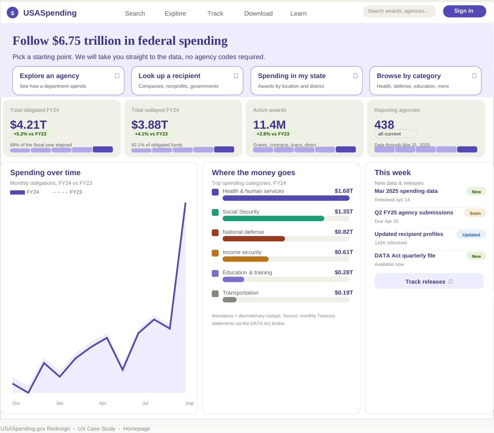

# Portfolio site

A small, dependency-free portfolio for a Principal UX Designer & Researcher. No build step —
just HTML and one CSS file. Edit the text, drop in your screenshots, push to GitHub.

## Files

```
index.html          Home page (intro, work, approach, about, contact)
usaspending.html    Case study — USASpending.gov
pacer.html          Case study — PACER.gov
bls.html            Case study — BLS.gov
styles.css          Shared design system for all pages (edit colors/fonts here once)
images/             (you create this) screenshots and mockups
```

Every page links to `styles.css`, so changing a color or font in that one file updates
the whole site.

## Publish on GitHub Pages (about 3 minutes)

1. Create a new repository on GitHub.
   - For a URL like `https://yourusername.github.io`, name the repo **exactly**
     `yourusername.github.io`.
   - For a URL like `https://yourusername.github.io/portfolio`, name it anything
     (e.g. `portfolio`).
2. Upload **all** the files above (and the `images/` folder once you add screenshots).
   Either drag-and-drop the whole folder via **Add file -> Upload files** on github.com,
   or push with git:
   ```
   git init
   git add .
   git commit -m "Portfolio site"
   git branch -M main
   git remote add origin https://github.com/yourusername/REPO.git
   git push -u origin main
   ```
3. In the repo, go to **Settings -> Pages**.
4. Under **Build and deployment -> Source**, choose **Deploy from a branch**.
5. Set branch to **main** and folder to **/ (root)**, then **Save**.
6. Wait ~1 minute, refresh, and your live URL appears at the top of that Pages screen.

The home page links to the three case studies, and each case study links back and to the
next one, so the whole site works as soon as the files are in the repo together.

## Before you publish — edit checklist

Your name appears as `Gary [Lastname]` in **all four** HTML files (title tag, top-left
brand, footer). Replace it in each. Then:

- **`index.html`** — the page title and description, and the contact links near the bottom
  (`mailto:`, LinkedIn URL, resume link). For the resume, add a PDF to the repo
  (e.g. `resume.pdf`) and point the link at it.
- **The three case study pages** — I wrote a full first draft of each (overview, problem,
  research with personas, information architecture, design, outcome) from your real
  deliverables. The personas and specific findings are scaffolding marked with
  `<!-- EDIT -->` comments; replace them with your actual research and artifacts.
- Each case study is honestly labeled as a **self-directed concept study, not affiliated
  with the agency**. Keep that line — it is both accurate and a credibility signal.

## Add your screenshots

Make an `images/` folder next to the HTML files. Each page expects these (rename freely,
just match the `src`):

- Home cards: `images/usaspending.png`, `images/pacer.png`, `images/bls.png`
- Each case study page: `images/<name>-hero.png`, `images/<name>-ia.png`,
  `images/<name>-screen-1.png`, `images/<name>-screen-2.png`
  (where `<name>` is `usaspending`, `pacer`, or `bls`)

To fill a slot, find the matching block, e.g.:

```html
<div class="shot"><span>Hero mockup -> images/usaspending-hero.png</span></div>
```

and replace the inner `<span>...</span>` with:

```html

```

Keep the surrounding `<div class="shot">` — it sizes and frames the image.

## Custom domain (optional)

If you own a domain, add a file named `CNAME` (no extension) containing just your domain,
e.g. `garylastname.com`, then set the DNS records GitHub shows you under Settings -> Pages.

## Notes

- Fonts (Bricolage Grotesque, Inter, JetBrains Mono) load from Google Fonts, so the page
  needs an internet connection to render with the intended type. That's normal for Pages.
- The design is responsive, keyboard-accessible, and respects reduced-motion preferences.
